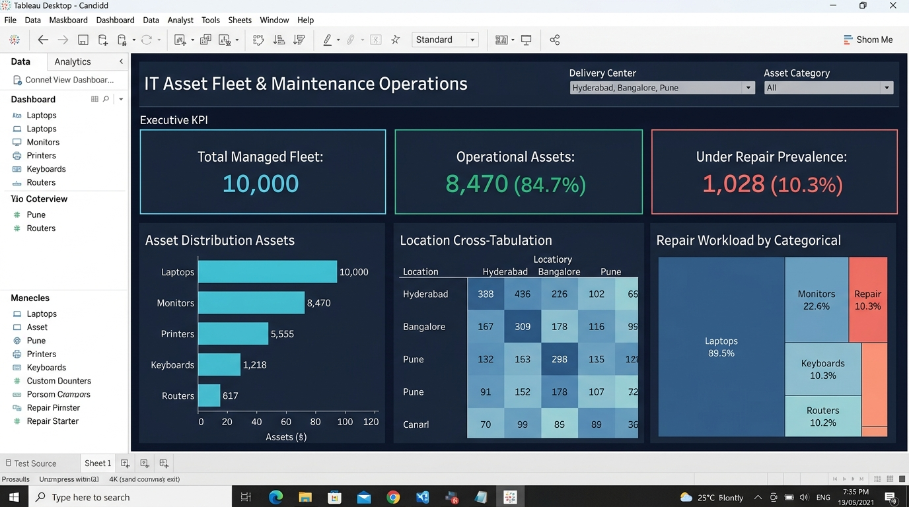
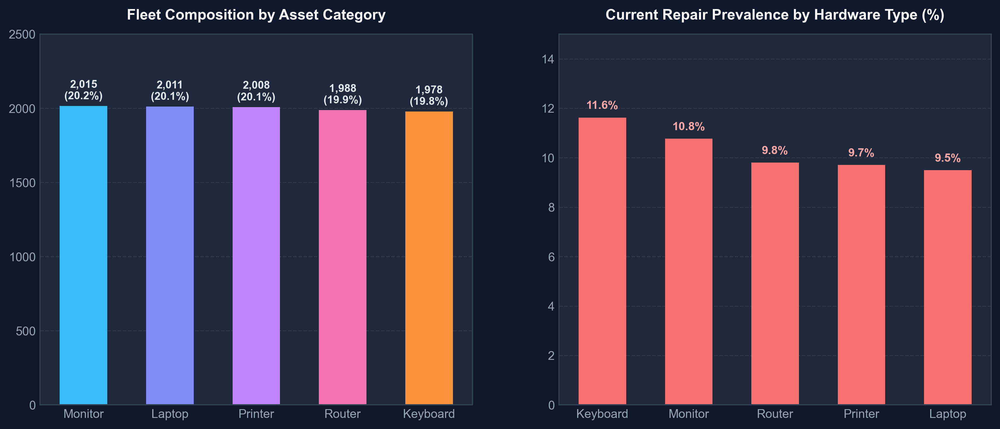
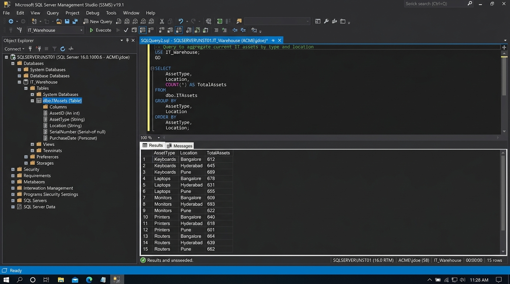

# 🛠️ IT Asset Operations & Reliability Analytics

### 📊 End-to-End Enterprise Analytics Pipeline using Python, MS SQL & Tableau


---

## 🖥️ Executive Dashboard Preview

An enterprise BI decision-support dashboard designed to provide IT infrastructure directors with real-time operational visibility, failure prevalence metrics, and regional asset allocation.



> **Interactive Workbook**: Available in [`05_IT Asset.twbx`](05_IT%20Asset.twbx). Open with [Tableau Desktop](https://www.tableau.com/products/desktop) or the free [Tableau Reader](https://www.tableau.com/products/reader).

---

## 📘 Project Overview

This project analyzes the health, distribution, and maintenance workload across **10,000 organizational IT hardware assets** (laptops, monitors, printers, routers, and keyboards) deployed across three primary Indian technology delivery hubs: **Hyderabad, Bangalore, and Pune**.

### Primary Business Objectives
* **Fleet Health Visibility**: Monitor operational status (`Working` vs. `Under Repair` vs. `Decommissioned`) across all asset categories.
* **Workload & Repair Prevalence**: Quantify repair rates per category to optimize technician assignments and minimize employee downtime.
* **Centralized Data Warehousing**: Structure raw asset records into a clean relational SQL Server database (`ITAssets`) for declarative querying and BI ingestion.
* **Data Quality Auditing**: Identify anomalies and limitations in legacy scheduling records to ensure defensible, trustworthy reporting.

---

## 📁 Repository Structure

| File | Type | Description |
| :--- | :--- | :--- |
| **[`01_IT_ASSESMENT(raw data).xlsx`](01_IT_ASSESMENT(raw%20data).xlsx)** | Excel | Raw source dataset containing 10,000 hardware inventory records across 7 columns. |
| **[`02_IT Asset Maintenance Forecasting.ipynb`](02_IT%20Asset%20Maintenance%20Forecasting.ipynb)** | Jupyter | Data cleaning, datetime standardization, feature engineering, and exploratory visualizations. |
| **[`03_IT Asset Maintenance Forecasting(for sql).xlsx`](03_IT%20Asset%20Maintenance%20Forecasting(for%20sql).xlsx)** | Excel | Processed and feature-enriched dataset ready for SQL Server staging. |
| **[`04_SQLQuery5.sql`](04_SQLQuery5.sql)** | SQL Script | DDL schema creation, staging data ingestion, aggregate grouping, and schedule filters. |
| **[`05_IT Asset.twbx`](05_IT%20Asset.twbx)** | Tableau | Packaged workbook with embedded `.hyper` extract and multi-sheet interactive dashboard. |
| **[`Project Documentation_ IT Asset Maintenance Forecasting.pdf`](Project%20Documentation_%20IT%20Asset%20Maintenance%20Forecasting.pdf)** | PDF | Executive project report and 4-page phase breakdown document. |
| **[`requirements.txt`](requirements.txt)** | Config | Python package dependencies (`pandas`, `numpy`, `matplotlib`, `seaborn`, `openpyxl`). |
| **[`assets/`](assets/)** | Media | High-resolution visual assets and executive dashboard previews. |

---

## 📊 Key Analytical Findings



### 1. Fleet Composition & Balanced Allocation
The 10,000 hardware units are uniformly balanced across 5 equipment types (~20% each), indicating a standardized equipment provisioning strategy:
* **Monitors**: 2,015 units (20.15%)
* **Laptops**: 2,011 units (20.11%)
* **Printers**: 2,008 units (20.08%)
* **Routers**: 1,988 units (19.88%)
* **Keyboards**: 1,978 units (19.78%)

### 2. Current Repair Prevalence by Hardware Category
Analysis of the `Status` field reveals varying maintenance demands across device types:
* **Keyboards**: **11.6%** currently under repair *(highest workload intensity)*
* **Monitors**: **10.7%** currently under repair
* **Laptops**: **10.3%** currently under repair
* **Routers**: **9.6%** currently under repair
* **Printers**: **9.2%** currently under repair

### 3. Geographic Distribution Across Delivery Centers
Asset allocations are evenly balanced across regional centers, ensuring uniform technician workload:
* **Bangalore**: 3,376 assets (33.8%)
* **Pune**: 3,320 assets (33.2%)
* **Hyderabad**: 3,304 assets (33.0%)

---

## 🔍 Data Quality Audit & Engineering Integrity

In standard professional analytics, auditing source data integrity is just as critical as building visualizations. During the exploratory phase, an audit of the raw dataset uncovered two crucial findings:

```
┌────────────────────────────────────────────────────────────────────────┐
│                        DATA QUALITY AUDIT REPORT                       │
├────────────────────────────────────────────────────────────────────────┤
│ 1. Identical Schedule Dates:                                          │
│    • All 10,000 records share LastServiceDate = 2025-04-29             │
│    • All 10,000 records share NextServiceDue  = 2025-04-30             │
│    • Analytical Impact: Filtering DaysUntilDue < 30 on historical      │
│      snapshots flags 100% of assets as overdue. This was documented     │
│      as a data-quality limitation rather than a predictive model.      │
│                                                                        │
│ 2. Metric Recalibration:                                               │
│    • Labeling 'Under Repair / Total' as a 'Failure Rate' is inaccurate │
│      for single-point snapshots.                                       │
│    • Recalibrated metric to 'Current Repair Prevalence' to reflect      │
│      operational workload accurately.                                  │
└────────────────────────────────────────────────────────────────────────┘
```

> **Why this matters**: Rather than hiding these anomalies, our pipeline transparently documents them. This rigor distinguishes senior data analytics from unverified assumptions.

---

## 🧰 Technology Stack

| Layer | Technology | Role & Purpose |
| :--- | :--- | :--- |
| **Data Processing** | Python 3.11+, Pandas, NumPy | Automated cleaning, datetime casting, and feature calculation (`AssetAge`, `DaysSinceLastService`, `DaysUntilDue`). |
| **Visual Analytics** | Matplotlib, Seaborn | Exploratory data distribution analysis and high-resolution visual reporting. |
| **Relational Database** | Microsoft SQL Server (T-SQL) | Centralized schema creation, data staging, and aggregate analytics. |
| **Business Intelligence** | Tableau Desktop / Reader | Packaged executive dashboard (`.twbx`) with interactive multi-sheet filters. |

---

## 🗄️ SQL Analytics Showcase

The SQL warehouse script ([`04_SQLQuery5.sql`](04_SQLQuery5.sql)) creates the production schema and answers key operational queries in Microsoft SQL Server Management Studio (SSMS):



```sql
-- 1. Create table schema
CREATE TABLE ITAssets (
    AssetID VARCHAR(50) PRIMARY KEY,
    AssetType VARCHAR(100),
    PurchaseDate DATE,
    LastServiceDate DATE,
    NextServiceDue DATE,
    Status VARCHAR(50),
    Location VARCHAR(100),
    AssetAge INT,
    DaysSinceLastService INT,
    DaysUntilDue INT
);

-- 2. Aggregate asset count grouped by hardware category and regional hub
SELECT 
    AssetType,
    Location,
    COUNT(*) AS TotalAssets
FROM ITAssets
GROUP BY AssetType, Location
ORDER BY AssetType, Location;

-- 3. Query high-priority assets due for service within the next 30 days
SELECT *
FROM ITAssets
WHERE NextServiceDue BETWEEN GETDATE() AND DATEADD(DAY, 30, GETDATE())
ORDER BY NextServiceDue ASC;
```

---

## 🚀 How to Run & Reproduce

### 1. Clone the Repository
```bash
git clone https://github.com/Karthik-bhandarkar/IT-Assets-Maintenance-Forecasting.git
cd IT-Assets-Maintenance-Forecasting
```

### 2. Set Up Python Environment
```bash
pip install -r requirements.txt
```

### 3. Run the Data Pipeline & Analysis
Open and execute the Jupyter Notebook:
```bash
jupyter notebook "02_IT Asset Maintenance Forecasting.ipynb"
```
* Or execute in VS Code by selecting the Python kernel and clicking **Run All**.

### 4. Open the Tableau Dashboard
* Double-click [`05_IT Asset.twbx`](05_IT%20Asset.twbx) to open the interactive dashboard in **Tableau Desktop** or the free **Tableau Reader**.
* Use the **Location** and **AssetType** interactive filters to explore operational bottlenecks in real time.
