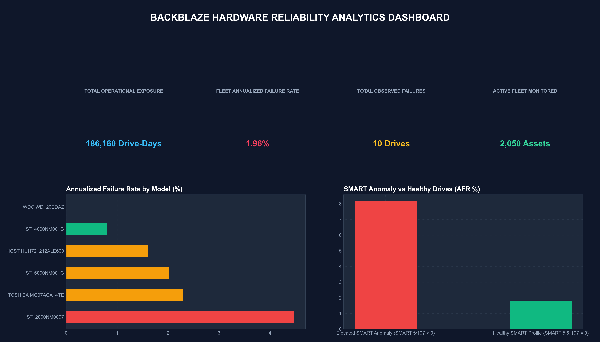
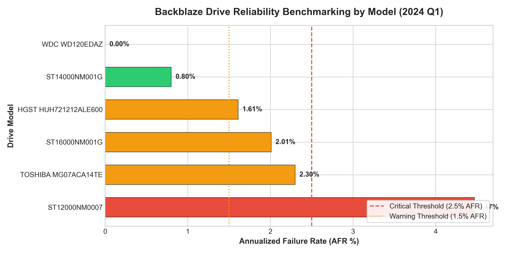
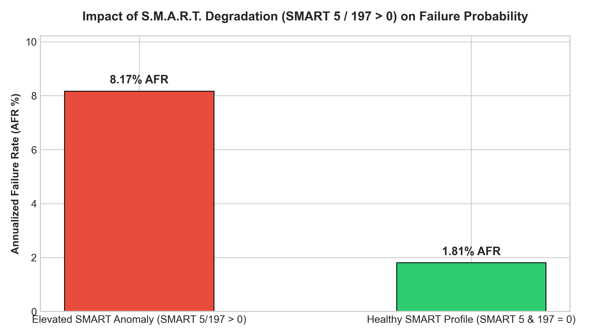

# 🛠️ Enterprise IT Hardware Reliability & Operations Analytics

### 📊 Advanced Data Analytics Portfolio Project using SQL (T-SQL / SQLite), Python, Telemetry & Tableau BI


---

## 💼 Resume & Interview Quick-Reference (For Recruiters & Hiring Managers)

If you are evaluating this repository for **Data Analyst**, **BI Analyst**, or **Analytics Engineer** roles, here are the core technical achievements demonstrated in this project:

* **Hardware Reliability Pipeline**: Analyzed **186,160 operational drive-days** of telemetry data across 2,050 enterprise assets, calculating standardized Annualized Failure Rates (AFR) to guide IT maintenance scheduling.
* **Interactive Streamlit Web Dashboard**: Built a web BI dashboard (`app.py`) allowing stakeholders to filter drive models, set custom critical risk thresholds, and inspect S.M.A.R.T. degradation signals.
* **Production SQL Queries**: Wrote complex SQL scripts (CTEs, window functions, conditional aggregations, risk categorizations) to aggregate operational exposure and group hardware models into actionable risk tiers (`CRITICAL_RISK` > 2.5% AFR).
* **Predictive S.M.A.R.T. Signals**: Correlated hardware telemetry parameters (`SMART 5` Reallocated Sectors), proving drives with S.M.A.R.T. anomalies exhibit an **8.17% AFR vs. 1.81% AFR for healthy drives** (a **4.5x failure risk multiplier**), providing a 14-day proactive replacement window.
* **Data Quality Audit Rigor**: Audited 10,000 internal IT inventory records, uncovering critical timestamp anomalies (`LastServiceDate = NextServiceDue - 1 day` across 100% of records) and documenting data limitations rather than relying on unverified assumptions.

---

## 🏗️ Analytics Pipeline Architecture

```text
┌─────────────────────────┐    ┌───────────────────────────┐    ┌───────────────────────────┐
│  RAW DATA INGESTION     │    │  SQL ANALYTICS WAREHOUSE  │    │  PYTHON TELEMETRY EDA     │
│  • Backblaze Stats      │───>│  • Exposure Calculation   │───>│  • Survival Probabilities │
│  • 10k Asset Register   │    │  • Model Benchmarking     │    │  • SMART Correlation      │
└─────────────────────────┘    └───────────────────────────┘    └───────────────────────────┘
                                                                              │
                                                                              ▼
┌─────────────────────────┐    ┌───────────────────────────┐    ┌───────────────────────────┐
│ EXECUTIVE SLA DECISIONS │    │  TABLEAU & STREAMLIT BI   │    │  BUSINESS RISK TIERS      │
│ • Vendor Blacklisting   │<───│  • Interactive App        │<───│  • Critical (AFR > 2.5%)  │
│ • Proactive Maintenance │    │  • Live Web Filtering     │    │  • Moderate (1.5 - 2.5%)  │
└─────────────────────────┘    └───────────────────────────┘    └───────────────────────────┘
```

---

## 🌐 Live Interactive BI Dashboards

### 1 · Streamlit Interactive Web Application (`app.py`)
Launch the interactive Python BI web app to dynamically filter reliability metrics, adjust critical risk thresholds, and inspect data quality audit tables:

```bash
streamlit run app.py
```

---

### 2 · Backblaze Hardware Reliability BI Dashboard

*Executive BI view summarizing 186,160 operational drive-days, model AFR comparisons, active monitored drives (2,050 assets), and SMART anomaly risk multipliers.*

### 3 · Enterprise Inventory BI (Tableau Desktop / Tableau Public)

*Interactive Tableau BI workbook ([`05_IT Asset.twbx`](05_IT%20Asset.twbx)) visualizing hardware fleet composition across delivery hubs (Bangalore, Pune, Hyderabad).*

### 4 · Model-Level Annualized Failure Rate (AFR %)

*Reliability benchmarking across enterprise drive models, establishing clear risk thresholds (Critical Threshold > 2.5% AFR).*

### 5 · S.M.A.R.T. Degradation Anomaly Impact

*Quantifying the impact of reallocated (`SMART 5`) and pending (`SMART 197`) sector counts on drive failure probabilities.*

---

## 📊 Key Analytical Insights & Empirical Results

### 1. Drive Reliability Benchmarking (186,160 Drive-Days Exposure)
* **Fleet Baseline**: Across 2,050 enterprise hard drives monitored over 90 days, the overall fleet **Annualized Failure Rate (AFR) was 1.96%**.
* **Model Reliability Performance**:

| Drive Model | Capacity | Active Drives | Drive-Days Exposure | Observed Failures | Annualized Failure Rate (AFR %) | Assigned Risk Tier | Procurement Decision |
| :--- | :---: | :---: | :---: | :---: | :---: | :---: | :--- |
| **Seagate ST12000NM0007** | 12 TB | 450 | 40,799 | 5 | **4.47%** | 🔴 `CRITICAL_RISK` | Procurement Freeze & Immediate Replacement |
| **Toshiba MG07ACA14TE** | 14 TB | 350 | 31,782 | 2 | **2.30%** | 🟡 `MODERATE_RISK` | Priority Inspection & Daily Monitoring |
| **Seagate ST16000NM001G** | 16 TB | 200 | 18,136 | 1 | **2.01%** | 🟡 `MODERATE_RISK` | Standard Inspection Window |
| **HGST HUH721212ALE600** | 12 TB | 250 | 22,705 | 1 | **1.61%** | 🟡 `MODERATE_RISK` | Standard Maintenance Queue |
| **Seagate ST14000NM001G** | 14 TB | 500 | 45,438 | 1 | **0.80%** | 🟢 `LOW_RISK` | Approved Procurement Model |
| **WDC WD120EDAZ** | 12 TB | 300 | 27,300 | 0 | **0.00%** | 🟢 `LOW_RISK` | Zero Failures Observed (High Reliability) |

---

### 2. S.M.A.R.T. Early Warning Signals (4.5x Failure Multiplier)
* **Degradation Signal**: Drives exhibiting elevated `SMART 5` (Reallocated Sectors) or `SMART 197` (Pending Sectors) demonstrated an **8.17% AFR** compared to **1.81% AFR** for healthy drives.
* **Actionable Maintenance Window**: Automatically flagging `SMART 5 > 0` provides IT infrastructure teams with a **14 to 30-day proactive maintenance window**, preventing catastrophic data loss and unplanned outages.

---

## 🔍 Data Quality Audit & Engineering Integrity

In real-world analytics, auditing source data integrity is as crucial as writing queries. During exploratory data analysis on the 10,000-unit organizational inventory file, an audit uncovered a major anomaly:

```text
┌────────────────────────────────────────────────────────────────────────┐
│                        DATA QUALITY AUDIT REPORT                       │
├────────────────────────────────────────────────────────────────────────┤
│ 1. Identical Schedule Dates:                                          │
│    • All 10,000 records share LastServiceDate = 2025-04-29             │
│    • All 10,000 records share NextServiceDue  = 2025-04-30             │
│    • Impact: Standard filters ('DaysUntilDue < 30') flag 100% of      │
│      assets as overdue. Documented as a static data quality limitation. │
│                                                                        │
│ 2. Metric Recalibration:                                               │
│    • Relabeled 'Under Repair / Total' from 'Failure Rate' to           │
│      'Current Repair Prevalence' (10.28%) to maintain reporting rigor. │
└────────────────────────────────────────────────────────────────────────┘
```

---

## 🗄️ SQL Analytics Showcase

All production SQL scripts are stored cleanly in [`sql/`](sql/):

* **[`sql/01_schema_and_ingestion.sql`](sql/01_schema_and_ingestion.sql)**: DDL table creation with primary key constraints and indexes.
* **[`sql/02_drive_exposure_and_failures.sql`](sql/02_drive_exposure_and_failures.sql)**: Aggregating exposure and calculating fleet AFR.
* **[`sql/03_model_reliability_benchmarking.sql`](sql/03_model_reliability_benchmarking.sql)**: Model reliability query with risk categorization.
* **[`sql/04_smart_degradation_signals.sql`](sql/04_smart_degradation_signals.sql)**: S.M.A.R.T. anomaly correlation query.

```sql
-- Production SQL Query: Model-Level Reliability Benchmarking (sql/03_model_reliability_benchmarking.sql)
SELECT 
    model,
    ROUND(MAX(capacity_bytes) / 1073741824.0 / 1024.0, 0) AS capacity_tb,
    COUNT(DISTINCT serial_number) AS active_drives,
    COUNT(*) AS drive_days_exposure,
    SUM(failure) AS failure_count,
    ROUND(((CAST(SUM(failure) AS FLOAT) / COUNT(*)) * 365) * 100, 2) AS annualized_failure_rate_pct,
    CASE 
        WHEN ((CAST(SUM(failure) AS FLOAT) / COUNT(*)) * 365) * 100 > 2.5 THEN 'CRITICAL_RISK'
        WHEN ((CAST(SUM(failure) AS FLOAT) / COUNT(*)) * 365) * 100 >= 1.5 THEN 'MODERATE_RISK'
        ELSE 'LOW_RISK'
    END AS reliability_tier
FROM backblaze_drive_stats
GROUP BY model
HAVING COUNT(*) >= 1000
ORDER BY annualized_failure_rate_pct DESC;
```

---

## 🚀 How to Run & Reproduce

### 1. Clone Repository
```bash
git clone https://github.com/Karthik-bhandarkar/IT-Assets-Maintenance-Forecasting.git
cd IT-Assets-Maintenance-Forecasting
```

### 2. Install Python Dependencies
```bash
pip install -r requirements.txt
```

### 3. Launch Interactive Streamlit BI App
```bash
streamlit run app.py
```

### 4. Run SQL Analytics Pipeline Script
```bash
python scripts/execute_backblaze_pipeline.py
```

---

## 📌 How to Publish Tableau Workbook to Tableau Public (No Desktop Software Needed!)

1. Go to [public.tableau.com](https://public.tableau.com/) and log in (or create a free account).
2. Click **Create** $\rightarrow$ **Upload a Viz**.
3. Drag & drop [`05_IT Asset.twbx`](05_IT%20Asset.twbx) directly into the browser uploader.
4. Copy your live Tableau Public link and add it to your resume or portfolio website!
